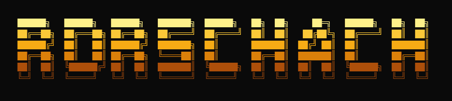

<div align="center">
  
</div>

<br>

<div align="center">
  
</div><br><br>

[](https://git.io/typing-svg)

---

## ⚡ SYSTEM STATUS

```
┌─────────────────────────────────────────────────────────┐
│  OPERATOR:     Rorschach                                │
│  ROLE:         Full-Stack Developer / Quant Researcher  │
│  STATUS:       ONLINE                                   │
│  UPTIME:       24/7 (except when sleeping)              │
│  FUEL:         Tea. Always tea.                         │
│  LOCATION:     [REDACTED]                               │
│  MISSION:      Build things that matter                 │
└─────────────────────────────────────────────────────────┘
```

---

## 🎮 GAME MODE

<!-- SNAKE: eats my contribution graph -->
<picture>
  <source media="(prefers-color-scheme: dark)" srcset="https://raw.githubusercontent.com/Rorschach730/Rorschach730/output/github-contribution-grid-snake-dark.svg">
  <source media="(prefers-color-scheme: light)" srcset="https://raw.githubusercontent.com/Rorschach730/Rorschach730/output/github-contribution-grid-snake.svg">
  
</picture>

---

## 💻 CODE MODE

```text
+------------------------------------------------------+
|                                                      |
| $ python -c "                                        |
| > class Rorschach:                                   |
| >     '''Full-Stack Dev & Quant Researcher'''        |
| >     name      = 'Rorschach'                        |
| >     languages = ['Python', 'C++', 'Chinese', 'Eng']|
| >     skills    = {                                  |
| >       'ml':     ['PyTorch', 'Flow Matching'],      |
| >       'quant':  ['GARP', 'Factors', 'Backtesting'],|
| >       'devops': ['Docker', 'Linux', 'MongoDB'],    |
| >     }                                              |
| >     current = 'Building autonomous trading systems'|
| > "                                                  |
| > Hello, World! Welcome to my code dimension.        |
|                                                      |
+------------------------------------------------------+
```

---

## 📊 DYNAMIC REALTIME

<div align="center">

[](https://github.com/vn7n24fzkq/github-profile-summary-cards)

[](https://github.com/vn7n24fzkq/github-profile-summary-cards)
[](https://github.com/vn7n24fzkq/github-profile-summary-cards)

[](https://github.com/Rorschach730)

[](https://github.com/Rorschach730)

</div>

---

## 🔥 ACTIVITY HEATMAP

[](https://github.com/ashutosh00710/github-readme-activity-graph)

---

## 🛠 TECH ARSENAL

```
┌─── BACKEND ────────────────────────────────────────────┐
│  Python    ████████████████████░░░░░░  85%             │
│  C++       ██████████████░░░░░░░░░░░░  60%             │
│  Java      ██████████░░░░░░░░░░░░░░░░  40%             │
└────────────────────────────────────────────────────────┘

┌─── ML / AI ────────────────────────────────────────────┐
│  PyTorch   ██████████████████░░░░░░░  80%             │
│  Gen AI    ██████████████░░░░░░░░░░░░  65%             │
│  Quant     ████████████████░░░░░░░░░░  70%             │
└────────────────────────────────────────────────────────┘

┌─── DEVOPS ─────────────────────────────────────────────┐
│  Docker    ██████████████████░░░░░░░  80%             │
│  Linux     ████████████████████░░░░░░  85%             │
│  Git       ██████████████████████░░░░  90%             │
└────────────────────────────────────────────────────────┘
```

<div align="center">


</div>

---

## 🚀 PROJECTS

| ❯ | Project | Description | Stack |
|---|---------|-------------|-------|
| 📈 | [TradingAgents-CN](https://github.com/Rorschach730/TradingAgents-CN) | AI-Powered A-Share Trading | Python, LLM, MongoDB |
| 🧬 | [flow_matching](https://github.com/Rorschach730/flow_matching) | Flow Matching Generative Models | Python, PyTorch |
| 🎯 | [JiT-main](https://github.com/Rorschach730/JiT-main) | Just-in-Time ML System | Python |
| 🎓 | [tuijianxitong](https://github.com/Rorschach730/tuijianxitong) | Recommendation System | Python |
| 🚣 | [Starter](https://github.com/Rorschach730/Starter) | PaddlePaddle Bootcamp | Python |

---

## 📡 CONNECT

```
┌─────────────────────────────────────────────────────────┐
│  📧 EMAIL    :  1027559304@qq.com                       │
│  📝 BLOG     :  blog.csdn.net/weixin_42818797            │
│  🐙 GITHUB   :  github.com/Rorschach730                  │
└─────────────────────────────────────────────────────────┘
```

<div align="center">

[](mailto:1027559304@qq.com)
[](https://blog.csdn.net/weixin_42818797)
[](https://github.com/Rorschach730)

</div>

---

```
╔══════════════════════════════════════════════════════════╗
║  SYSTEM READY.                                          ║
║  > May your code compile on the first try,              ║
║  > and your bugs be features in disguise.               ║
║  > EOF                                                  ║
╚══════════════════════════════════════════════════════════╝
```

<div align="center">


</div>

<!--
  ═══════════════════════════════════════════════════════
  BUILT WITH:
    - github-profile-summary-cards (vercel)
    - github-readme-stats (vercel)
    - github-readme-activity-graph (vercel)
    - readme-typing-svg (demolab)
    - shields.io badges
    - contribution-grid-snake (github actions)
  THEME: Cyberpunk Dark
    bg: #000000 | fg1: #00FF41 | fg2: #00FFFF | accent: #FF00FF
  ═══════════════════════════════════════════════════════
-->
